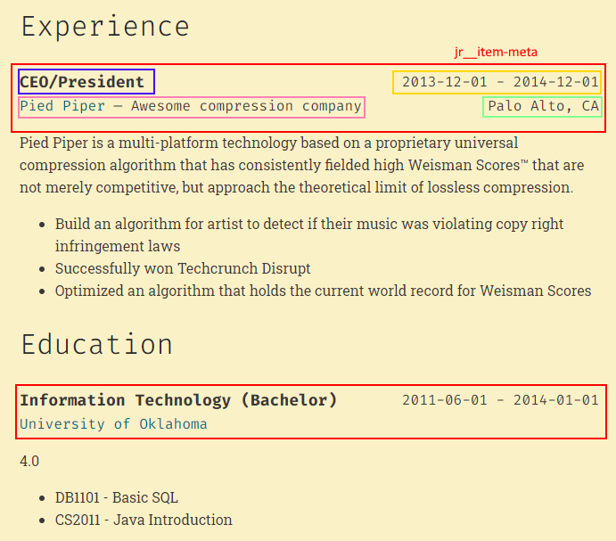

# hugo-mod-json-resume

A [Hugo module](https://gohugo.io/hugo-modules/) containing templates to
integrate multilingual [JSON Resume](https://jsonresume.org/) data into your
Hugo website.

## Getting Started

Initialize your Hugo site as a Hugo module:

```shell
hugo mod init example.com
```

Add the following to the `config.toml` file of your site to import the module:

```toml
[module]
  [[module.imports]]
    path = "github.com/schnerring/hugo-mod-json-resume"
  [[module.mounts]]
    source = "node_modules/simple-icons/icons"
    target = "assets/simple-icons"
```

Install the module:

```shell
hugo mod get
```

Initialize the NPM `package.json` and install the dependencies:

```shell
hugo mod npm pack
npm install
```

The module offers a simple CSS stylesheet [assets/css/json-resume.css](./assets/css/json-resume.css)
that you can use.

Use the `json-resume` shortcode in markdown files:

```markdown
---
title: "CV"
draft: false
---

## Experience



## Education


```

Or use the partials in your layout files:

```html
<div class="sidebar">
  <aside class="bio">{{ partial "json-resume/basics.html" . }}</aside>
</div>
```

## Data Structure

The module reads JSON Resume data from Hugo's `data/` directory:

```text
data/
├─ json_resume/
    ├─ de.json
    ├─ en.json
```

Each file must adhere to the [JSON Resume schema](https://github.com/jsonresume/resume-schema/blob/master/schema.json)
specification. At least one file with the name `<default content language code>.json`
must exist (defaults to `en`). See also [Hugo Multilingual Mode](https://gohugo.io/content-management/multilingual/).

## Styling

You can style the existing templates by using the pre-defined classes. There are
generic classes prefixed with `jr__` like `jr__item` or `jr__date-range` that
apply to any template.

Classes specific to resume sections are prefixed with `jr-<section>__<section-field>`,
like `jr-work__description` or `jr-basics__name`.

### Example



The above requires the following CSS:

```css
.jr__item-meta {
  align-items: center;
  flex-flow: row wrap;
}

.jr__date,
.jr__date-range,
.jr-work__location {
  flex-grow: 1;
  text-align: right;
}

.jr-education__institution {
  flex-basis: 100%;
}
```

## Attributions

To display social icons, [Simple Icons](https://simpleicons.org/) (CC0) are
used.
